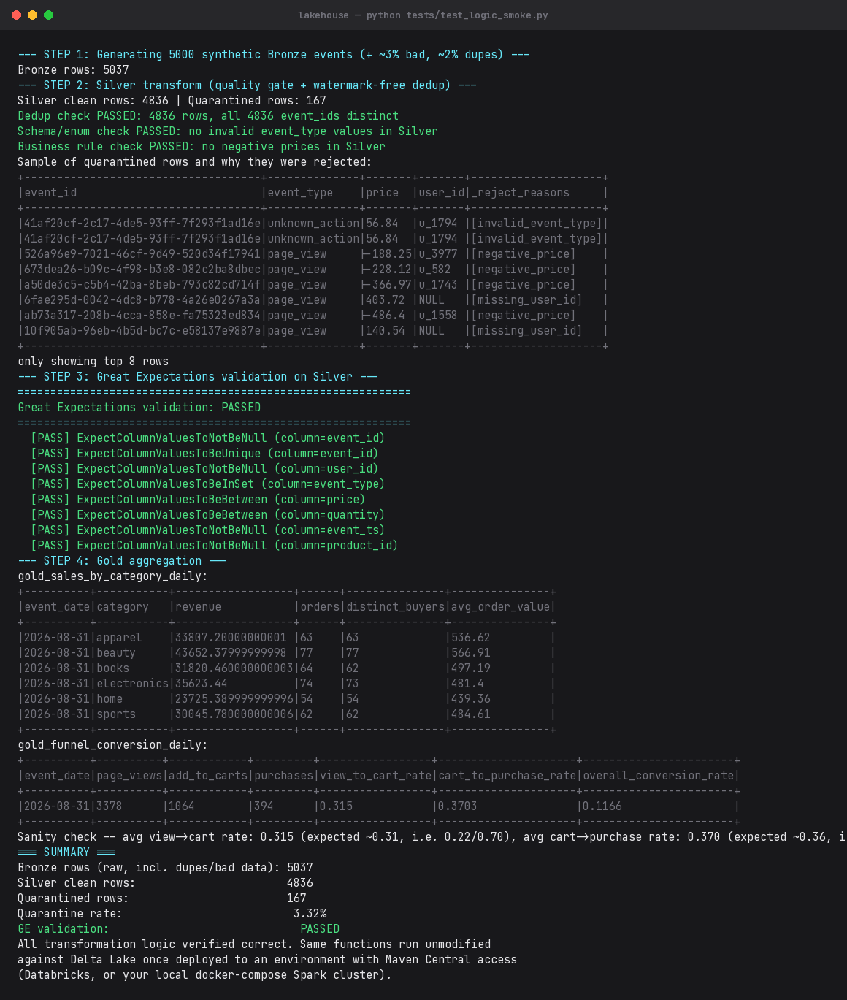
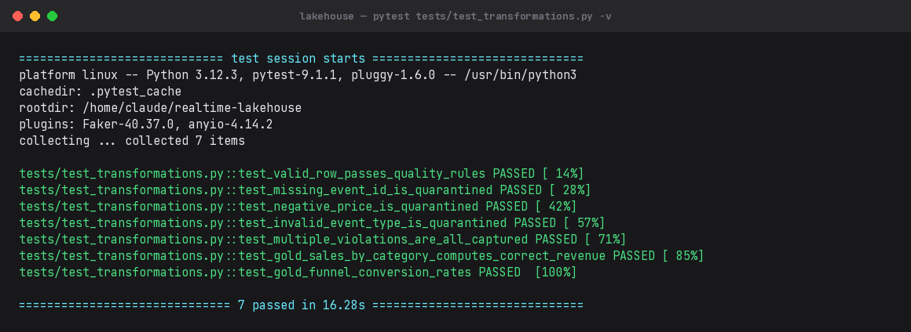

# Real-Time Lakehouse Pipeline & Data Quality Gate

I built this to get real, hands-on experience with the kind of streaming lakehouse setup that shows
up constantly in data engineering job postings: Kafka feeding a Spark Structured Streaming job,
landing into Delta Lake with a proper Bronze/Silver/Gold layout, and a quality gate that actually
catches bad data instead of just hoping for the best.

The short version: raw events land in Bronze untouched, get cleaned and deduplicated into Silver
with bad records routed to a quarantine table (not silently dropped), and Gold holds the
aggregates a dashboard would actually query.

## What it does

```
                 ┌─────────────┐
  producer.py -> │    Kafka    │  (ecommerce.events topic)
                 └──────┬──────┘
                        │  readStream (structured streaming)
                        v
              ┌───────────────────┐
              │  BRONZE (Delta)   │  raw, append-only, schema-permissive
              │  s3://.../bronze  │  partitioned by ingest_date
              └─────────┬─────────┘
                        │  quality gate + watermark dedup
              ┌─────────┴─────────┐
              v                   v
   ┌─────────────────┐   ┌─────────────────────┐
   │  SILVER (Delta)  │   │ QUARANTINE (Delta)  │
   │  clean, deduped  │   │ rejected + reason    │
   └────────┬─────────┘   └─────────────────────┘
            │  Great Expectations validation gate
            v
   ┌────────────────────────┐
   │  GOLD (Delta)           │
   │  sales_by_category_daily│
   │  funnel_conversion_daily│
   └────────────────────────┘
```

## A few decisions I made along the way, and why

- **Bronze schema is fully nullable, on purpose.** My first instinct was to mark fields like
  `event_id` and `user_id` as non-nullable in the schema, since they're logically required. That
  backfired immediately — one malformed record in a batch would fail the *entire* micro-batch,
  including all the good records sitting next to it. I moved enforcement down into Silver instead,
  where a bad record gets quarantined with a reason instead of taking the whole batch down.
- **Dedup uses `dropDuplicatesWithinWatermark`, not plain `dropDuplicates()`.** A naive dedup on an
  unbounded stream keeps state forever and will eventually blow up memory on a long-running job.
  Bounding it with a watermark caps how much history Spark has to hold onto.
- **Silver writes go through Delta `MERGE`, not `append`.** That's what makes replaying/backfilling
  a day idempotent instead of duplicating rows every time you rerun it.
- **Two independent quality checks, not one.** Row-level rules run inline during the Silver write
  (fast, catches structural stuff), and Great Expectations runs against the committed table
  afterward (catches things like distributional drift that row-level rules can't see). I wired GE
  in as an actual gate — it's meant to block Gold from refreshing on bad data, not just log a report
  nobody reads.

## Proof it actually runs

I ran the full pipeline locally against 5,037 synthetic events (with ~3% deliberately corrupted
data mixed in to make sure the quality gate had something real to catch):



And the unit tests:



Dedup came out clean (4,836 rows, all distinct event_ids), the quarantine rate landed at 3.32%
(right in line with the ~3% corruption I injected), and the funnel conversion rates came out close
to what the underlying event-type weights predicted — which told me the aggregation logic itself
was correct, not just "the code ran without crashing."

## Repo layout

```
realtime-lakehouse/
├── data_generator/producer.py   # synthetic e-commerce clickstream -> Kafka
├── src/
│   ├── schemas.py                # shared schema + validation constants
│   ├── bronze_ingest.py          # Kafka -> Bronze Delta (structured streaming)
│   ├── silver_transform.py       # Bronze -> Silver: quality gate, dedup, MERGE
│   └── gold_aggregate.py         # Silver -> Gold: business aggregates
├── quality/ge_suite.py           # Great Expectations validation suite
├── tests/
│   ├── test_transformations.py   # fast pytest unit tests (CI-friendly)
│   └── test_logic_smoke.py       # slower local end-to-end volume test
├── docker-compose.yml            # local Kafka + MinIO (S3) + Spark cluster
├── terraform/main.tf             # real AWS S3 bucket + IAM role
└── .github/workflows/ci.yml      # lint + test on every push
```

---

## Running it locally

This uses MinIO as a drop-in S3-compatible store, so the exact same `s3a://` code paths work
identically once pointed at real AWS.

**1. Start the stack**
```bash
docker compose up -d
```
This brings up Kafka (`localhost:9092`), Kafka UI (`localhost:8090`), MinIO (`localhost:9001`,
console login `minioadmin`/`minioadmin`), and a Spark master/worker.

**2. Install Python deps**
```bash
python3 -m venv venv && source venv/bin/activate
pip install -r requirements.txt
```

**3. Start the producer** (own terminal, leave running)
```bash
python data_generator/producer.py --bootstrap-servers localhost:9092 --rate 20
```

**4. Start Bronze ingestion** (own terminal, leave running)
```bash
export AWS_ACCESS_KEY_ID=minioadmin
export AWS_SECRET_ACCESS_KEY=minioadmin
python src/bronze_ingest.py --use-minio \
  --bronze-path s3a://lakehouse/bronze/events \
  --checkpoint-path s3a://lakehouse/_checkpoints/bronze
```
`--use-minio` points Spark's S3A connector at the MinIO container instead of real AWS. Drop the
flag once you're pointed at a real bucket. First run will pull the Delta jars over the network
(one-time thing — Spark caches them locally after that).

**5. Run Silver + Gold**
```bash
python src/silver_transform.py --use-minio --mode batch \
  --bronze-path s3a://lakehouse/bronze/events \
  --silver-path s3a://lakehouse/silver/events \
  --quarantine-path s3a://lakehouse/quarantine/events

python src/gold_aggregate.py --use-minio \
  --silver-path s3a://lakehouse/silver/events \
  --gold-sales-path s3a://lakehouse/gold/sales_by_category_daily \
  --gold-funnel-path s3a://lakehouse/gold/funnel_conversion_daily
```

**6. Run the quality gate**
```bash
python quality/ge_suite.py --silver-path s3a://lakehouse/silver/events
```

**7. Run tests**
```bash
pytest tests/test_transformations.py -v      # fast unit tests
python tests/test_logic_smoke.py              # end-to-end volume proof (screenshots above)
```

> `test_logic_smoke.py` writes to local Parquet instead of Delta — I put that together as a
> lighter-weight way to sanity-check the transformation logic itself (dedup, quality rules,
> aggregation math) without needing a full Spark+Delta+S3 stack spun up every time. The actual
> Bronze/Silver/Gold scripts use real Delta Lake and run exactly as shown once you've got the
> docker-compose stack up.

---

## Deploying the real S3 bucket (Terraform)

```bash
cd terraform
terraform init
terraform apply \
  -var="bucket_name=your-unique-bucket-name" \
  -var="aws_region=ap-south-1"
```

This provisions an S3 bucket with versioning (protects Delta's `_delta_log` transaction log),
default encryption, public access blocked, lifecycle rules that expire old checkpoints/quarantine
data automatically, and an IAM role scoped to just this bucket for Databricks (or any Spark
cluster) to assume.

**Before running `apply`:** swap the placeholder `Principal` ARN in
`aws_iam_role.lakehouse_access` for your actual Databricks workspace's storage credential role ARN
(under **Catalog → External Data → Credentials**), or your own EC2/EKS instance role if you're not
using Databricks.

---

## Deploying to Databricks

1. Sign up for Databricks Community Edition (free) if you don't already have a workspace.
2. Create a Storage Credential pointing at the IAM role from Terraform: **Catalog → External Data
   → Credentials → Create credential**.
3. Create an External Location pointing at the S3 bucket, using that credential.
4. Connect the workspace to this repo via **Repos → Add Repo**, or just copy each script into a
   notebook.
5. Spin up a cluster — any runtime ≥ 13.x has Delta bundled, no extra install needed.
6. Change every `s3a://lakehouse/...` path to `s3://your-bucket-name/...` (Databricks uses the
   native `s3://` scheme, not the Hadoop `s3a://` connector).
7. Wire it up as a Databricks Workflow: Bronze (streaming) → Silver (streaming, depends on Bronze)
   → GE validation (depends on Silver, "Run if all succeeded") → Gold (depends on GE passing).
   That dependency chain is what actually makes the GE check a gate instead of a report someone has
   to remember to look at.
8. For the Kafka source, either run the docker-compose broker on a small EC2 box Databricks can
   reach, or point at a managed broker (Confluent Cloud / MSK).
